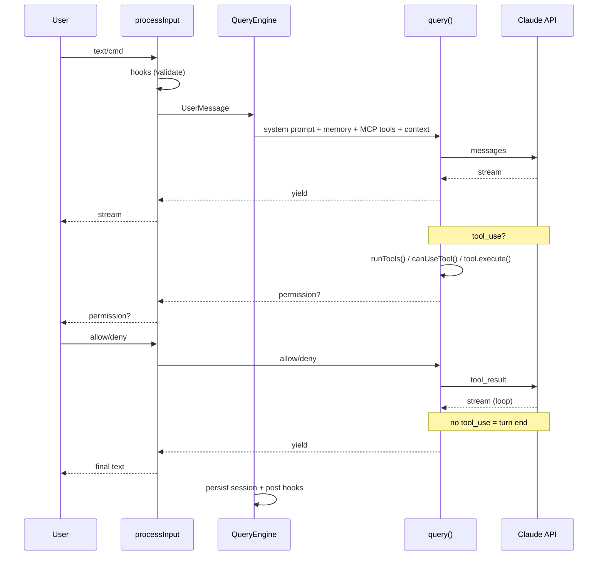
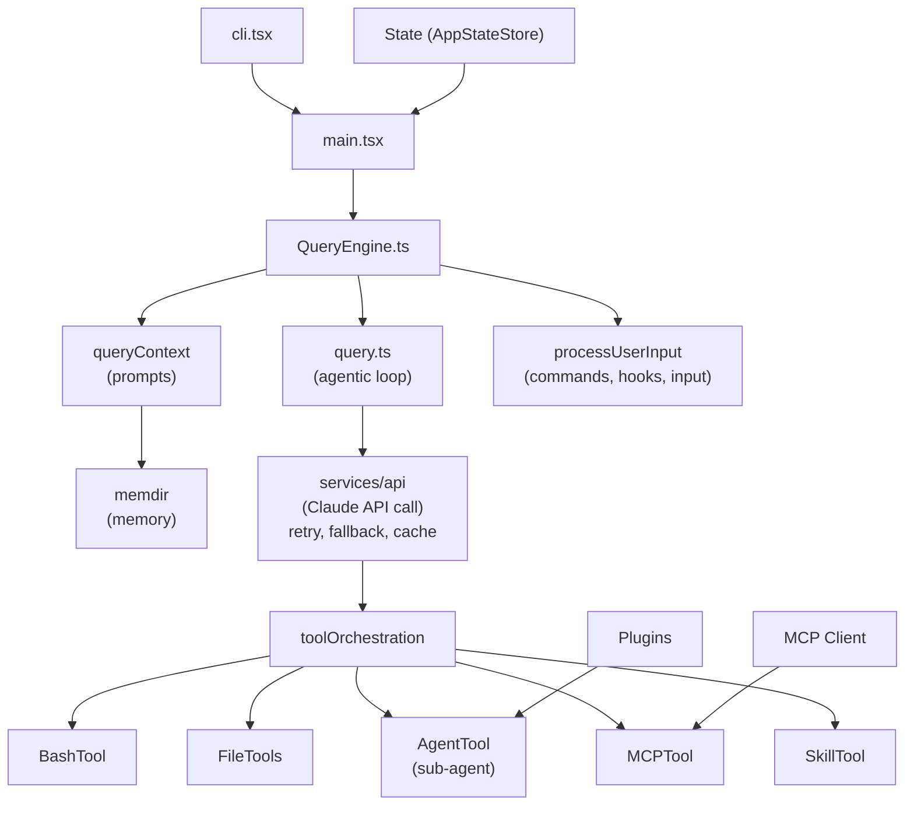

## Claude Code Full Chain Analysis: Complete Module Trace from Input to Response

---

### Overall Architecture Diagram

```
┌──────────────────────────────────────────────────────────────────────────┐
│                         Entrypoints Layer                                │
│  cli.tsx ──→ interactive (REPL) ──→ main.tsx ──→ launchRepl()            │
│          └─→ non-interactive (-p) ──→ ask() one-shot                    │
│          └─→ MCP server mode ──→ server/                                │
│          └─→ Agent SDK mode ──→ QueryEngine directly                    │
└──────────────────────────────────────────────────────────────────────────┘
                                    ↓
┌──────────────────────────────────────────────────────────────────────────┐
│                      User Input Processing Layer                         │
│  processUserInput() → slash commands / bash / text prompt                │
│  hooks: executeUserPromptSubmitHooks() → user-defined pre-hooks          │
└──────────────────────────────────────────────────────────────────────────┘
                                    ↓
┌──────────────────────────────────────────────────────────────────────────┐
│                     QueryEngine Layer                                    │
│  submitMessage() → system prompt assembly + API query loop               │
└──────────────────────────────────────────────────────────────────────────┘
                                    ↓
┌──────────────────────────────────────────────────────────────────────────┐
│                         Core Loop Layer (query.ts)                       │
│  while(true) { compress → API call → stream → tools → loop or exit }    │
└──────────────────────────────────────────────────────────────────────────┘
                                    ↓
┌──────────────────────────────────────────────────────────────────────────┐
│                          Response Output Layer                           │
│  yield SDKMessage → React/Ink UI rendering or stdout JSON                │
└──────────────────────────────────────────────────────────────────────────┘
```

---

### 1. Entrypoints: REPL vs CLI vs SDK

| Entry Mode | File | Behavior |
|----------|------|------|
| **Interactive REPL** | [cli.tsx](src/entrypoints/cli.tsx) → [main.tsx](src/main.tsx) | Launches React/Ink TUI, loops waiting for user input |
| **Non-interactive** (`-p`) | [cli.tsx](src/entrypoints/cli.tsx) → `ask()` | Single QueryEngine instance, outputs result to stdout |
| **MCP Server** | [src/server/](src/server/) | Acts as MCP protocol server, accepts external calls |
| **Agent SDK** | [src/entrypoints/agentSdkTypes.ts](src/entrypoints/agentSdkTypes.ts) | Directly instantiates QueryEngine, yields SDKMessage |

**REPL Main Loop** ([main.tsx](src/main.tsx)):
```
init → loadPlugins → loadSkills → loadMCPClients → createAppState
  → while(user input) {
      processUserInput() → QueryEngine.submitMessage() → render response
    }
```

---

### 2. User Input Processing (processUserInput)

**File**: [src/utils/processUserInput/processUserInput.ts](src/utils/processUserInput/processUserInput.ts)

```
User text
  ├─ /command → findCommand() → execute local command (no API call)
  ├─ !bash   → local shell execution, output displayed
  └─ plain text → create UserMessage
       ├─ attach images (paste/drag)
       ├─ attach IDE selection
       ├─ executeUserPromptSubmitHooks() → pre-hook validation
       └─ shouldQuery = true → enter QueryEngine
```

---

### 3. Commands System (Slash Commands)

**File**: [src/commands.ts](src/commands.ts)

87 commands registered in a static array. Key commands:
- `/compact` → manually trigger context compaction
- `/clear` → clear conversation
- `/memory` → view/edit memory
- `/config` → modify settings
- `/agents` → manage agent definitions

Commands fall into two categories:
- **LocalCommand**: purely local execution, no API call (`/clear`, `/config`)
- **PromptCommand**: generates a message then continues to call API (`/compact` forks a summary agent)

---

### 4. QueryEngine — Session Management

**File**: [src/QueryEngine.ts](src/QueryEngine.ts)

```typescript
class QueryEngine {
  mutableMessages: Message[]       // full conversation history
  readFileState: FileStateCache    // file read cache (turn-level)
  totalUsage: NonNullableUsage     // cumulative token consumption

  async *submitMessage(prompt): AsyncGenerator<SDKMessage> {
    // 1. parse model and thinking configuration
    // 2. fetchSystemPromptParts() → assemble system prompt
    // 3. create ToolUseContext (tool permissions, abort, MCP clients)
    // 4. attach memory attachments
    // 5. call query() generator → stream yield results
    // 6. persist session transcript
  }
}
```

---

### 5. Context System (System Prompt Assembly)

**File**: [src/utils/queryContext.ts](src/utils/queryContext.ts) + [src/constants/prompts.ts](src/constants/prompts.ts)

The system prompt is assembled from multiple **sections**, each with a caching strategy:

```
System Prompt composition:
┌─────────────────────────────────────────────┐
│ ① Core identity prompt (role, behavior rules)│  ← cache: global, long TTL
│ ② Tool list (schemas for 40+ tools)         │  ← cache: global
│ ③ Skill descriptions (available skill names) │  ← cache: session
│ ④ MCP tool descriptions (MCP server tools)  │  ← cache: session
│ ⑤ Memory prompt (MEMORY.md + relevant mem.) │  ← cache: ephemeral
│ ⑥ Environment info (OS, CWD, git, model)    │  ← cache: ephemeral
│ ⑦ Custom prompt (CLAUDE.md, append)         │  ← cache: session
│ ⑧ Output style, language settings           │  ← cache: ephemeral
└─────────────────────────────────────────────┘

User Context (injected before the first user message):
  - gitStatus, IDE selection, notifications, attachments

System Context (appended to the end of the system prompt):
  - current date, session hints, coordinator info
```

---

### 6. Memory System

**File**: [src/memdir/memdir.ts](src/memdir/memdir.ts)

```
Loading flow:
  loadMemoryPrompt()
    → read MEMORY.md (index file, max 200 lines)
    → read referenced memory files (.claude/memory/*.md)
    → truncateEntrypointContent() truncate to 25KB
    → inject into system prompt section

Relevant memory search:
  startRelevantMemoryPrefetch()   ← starts async at the beginning of query loop
    → findRelevantMemories()      ← semantic match against current conversation
    → injected as AttachmentMessage
```

Memory types: user / feedback / project / reference — stored as frontmatter markdown files.

---

### 7. MCP System

**File**: [src/services/mcp/client.ts](src/services/mcp/client.ts)

```
MCP lifecycle:
  configure MCP servers in settings.json
    → create MCPServerConnection at startup (stdio/sse/http/ws)
    → client.listTools() → register as MCPTool
    → client.listResources() → register as ReadMcpResourceTool

MCPTool execution:
  model calls mcp__server__toolname in query loop
    → MCPTool.execute()
      → client.callTool(name, args)
      → return tool_result (text/image/resource)

MCP in prompt:
  getMcpInstructionsSection() lists all MCP tool names + descriptions
  OR delta attachments (incremental updates, avoids prompt bloat)
```

---

### 8. Tool System

**File**: [src/Tool.ts](src/Tool.ts) + [src/services/tools/toolOrchestration.ts](src/services/tools/toolOrchestration.ts)

```
Tool interface:
  name, inputSchema (Zod), execute(), isReadOnly, userFacingName
  
Tool registration (tools.ts):
  BashTool, FileReadTool, FileEditTool, FileWriteTool,
  GlobTool, GrepTool, WebSearchTool, WebFetchTool,
  AgentTool, SkillTool, MCPTool, TodoWriteTool,
  NotebookEditTool, ScheduleCronTool ...

Execution flow (toolOrchestration.ts → runTools()):
  ① collect all tool_use blocks
  ② classify: read-only → concurrent execution | write → serial execution
  ③ before each tool execution: canUseTool() permission check
     → allow / deny / ask_user (show confirmation prompt)
  ④ tool.execute(input, context) → return ToolResult
  ⑤ large results go through toolResultStorage to file, replaced with reference

StreamingToolExecutor:
  as model streams output, tool_use blocks start executing upon arrival
  → runs in parallel with model generating remaining content
  → significantly reduces turn latency
```

---

### 9. Skill System

**File**: [src/skills/loadSkillsDir.ts](src/skills/loadSkillsDir.ts)

```
Skill = discoverable imperative prompt + optional shell script

Sources:
  .claude/skills/ (project-level)
  ~/.claude/skills/ (user-level)
  managed policy dirs (enterprise-level)
  plugin skills

Loading:
  Markdown file parses frontmatter (name, description, allowed_tools)
  → register into command pool
  → listed in system prompt skill list

Invocation:
  model calls SkillTool → load skill markdown → inject as prompt → execute
  OR user /skill-name → triggered directly
```

---

### 10. Hooks System

**File**: [src/utils/hooks.ts](src/utils/hooks.ts)

```
Hook execution timing:
  ┌─ userPromptSubmit ──→ before user submits (validation/interception)
  ├─ preSampling ───────→ before API call
  ├─ postSampling ──────→ after API response
  ├─ preCompact ────────→ before compaction
  ├─ postCompact ───────→ after compaction
  └─ stopFailure ───────→ on stop/error

Execution method:
  spawn subprocess → pass JSON to stdin → read stdout/stderr
  hook can return: { block: true, message: "..." } to block the operation
```

---

### 11. API Service (Claude API Calls)

**File**: [src/services/api/claude.ts](src/services/api/claude.ts)

```
callModel() request body:
  {
    model: "claude-sonnet-4-...",
    system: [{ type: "text", text: "...", cache_control }],
    messages: [...normalized messages...],
    tools: [...tool schemas...],
    max_tokens: 16384,
    stream: true,
    metadata: { user_id },
    betas: ["prompt-caching-2024-07-31", ...]
  }

Streaming response:
  message_start → content_block_start → content_block_delta → 
  content_block_stop → message_delta → message_stop

Error handling:
  - 429 rate limit → retry with backoff
  - 413 prompt too long → reactive compact or error
  - 500/529 → fallback model switch
  - withRetry() wraps all API calls
```

---

### 12. Compaction System (Context Compression)

**File**: [src/services/compact/](src/services/compact/)

```
Trigger conditions:
  autoCompact: tokenCount > threshold (approximately 80% of context window)
  reactive compact: emergency compaction when API returns 413
  manual: /compact command
  snip: history trimming (feature-gated)
  microcompact: compaction when a single tool result is too large

autoCompact flow:
  ① calculateTokenWarningState() determines if threshold is exceeded
  ② select compact boundary (retain most recent N messages)
  ③ fork a summary agent (using a smaller model)
  ④ generate conversation summary → buildPostCompactMessages()
  ⑤ replace original messages → continue query loop

Compaction levels (lightest to heaviest):
  snip (trim old messages) → microcompact (compress single result)
  → context collapse (collapse segments) → autocompact (full summary)
  → reactive compact (emergency 413 recovery)
```

---

### 13. Plugin System

**File**: [src/utils/plugins/pluginLoader.ts](src/utils/plugins/pluginLoader.ts)

```
Plugin structure:
  plugin.json (manifest: name, version, description)
  commands/     → registered as slash commands
  agents/       → registered as agent definitions
  hooks/        → merged into hook configuration
  skills/       → merged into skill pool

Loading methods:
  ① declare plugins list in settings.json
  ② --plugin-dir CLI argument (session-only)
  ③ marketplace plugins (plugin@marketplace)
  
Lifecycle:
  loadAllPlugins() → validate manifests → merge into registries
```

---

### 14. Agent Tool (Sub-agents)

**File**: [src/tools/AgentTool/AgentTool.tsx](src/tools/AgentTool/AgentTool.tsx)

```
Agent invocation flow:
  model decides to call AgentTool(description, prompt, subagent_type)
    → loadAgentsDir() looks up .claude/agents/ definitions
    → runAgent():
        ├─ create new QueryEngine instance (independent context)
        ├─ optional: worktree isolation (git worktree)
        ├─ optional: background execution (run_in_background)
        ├─ tool set can be trimmed (subagent_type determines available tools)
        └─ independent abort controller
    → yield progress updates
    → return agent output as tool_result

Sub-agent characteristics:
  - independent mutableMessages (does not share parent conversation)
  - shared file state cache
  - maxTurns limit prevents infinite loops
  - agentId identifier used for session persistence
```

---

### 15. State Management

**File**: [src/state/AppStateStore.ts](src/state/AppStateStore.ts)

```
AppState core fields:
  messages: Message[]                    // conversation history
  toolPermissionContext: {
    mode: PermissionMode                 // plan | normal | autonomous
    additionalWorkingDirectories: Map    // allowed extra directories
  }
  mcp: {
    clients: MCPServerConnection[]       // active MCP connections
    tools: MCPToolDefinition[]           // registered MCP tools
  }
  fastMode: boolean                      // fast mode
  effortValue: EffortValue               // effort level
  fileStateCache: FileStateCache         // file state cache

State transitions:
  QueryEngine reads/writes via getAppState()/setAppState()
  React components subscribe and render via Context
```

---

### 16. Complete Sequence Diagram



<details>
<summary>ASCII Version</summary>

```
┌─────┐     ┌────────────┐    ┌─────────────┐    ┌────────┐    ┌──────┐
│User │     │processInput│    │QueryEngine  │    │query() │    │Claude│
└──┬──┘     └─────┬──────┘    └──────┬──────┘    └───┬────┘    └──┬───┘
   │  text/cmd    │                   │               │            │
   │─────────────→│                   │               │            │
   │              │ hooks (validate)  │               │            │
   │              │──→ hook process   │               │            │
   │              │                   │               │            │
   │              │ UserMessage       │               │            │
   │              │──────────────────→│               │            │
   │              │                   │ system prompt  │            │
   │              │                   │ + memory       │            │
   │              │                   │ + MCP tools    │            │
   │              │                   │ + context      │            │
   │              │                   │───────────────→│            │
   │              │                   │               │ messages   │
   │              │                   │               │───────────→│
   │              │                   │               │            │
   │              │                   │               │  stream    │
   │              │                   │               │←───────────│
   │  stream      │                   │    yield      │            │
   │←─────────────│───────────────────│←──────────────│            │
   │              │                   │               │            │
   │              │                   │  tool_use?    │            │
   │              │                   │               │──→ runTools()
   │              │                   │               │    ├ canUseTool()
   │  permission? │                   │               │    ├ tool.execute()
   │←─────────────│───────────────────│←──────────────│    │
   │  allow/deny  │                   │               │    │
   │─────────────→│──────────────────→│──────────────→│    │
   │              │                   │               │    ↓
   │              │                   │               │ tool_result
   │              │                   │               │───────────→│
   │              │                   │               │  (loop)    │
   │              │                   │               │←───────────│
   │              │                   │               │            │
   │              │                   │  no tool_use  │            │
   │              │                   │  = turn end   │            │
   │  final text  │                   │    yield      │            │
   │←─────────────│───────────────────│←──────────────│            │
   │              │                   │               │            │
   │              │                   │ persist session│            │
   │              │                   │ post hooks     │            │
```

</details>

---

### 17. Inter-Module Dependency Graph



<details>
<summary>ASCII Version</summary>

```
                    ┌──────────┐
                    │ cli.tsx  │
                    └────┬─────┘
                         ↓
                    ┌──────────┐
                    │ main.tsx │ ←── State (AppStateStore)
                    └────┬─────┘
                         ↓
              ┌──────────────────────┐
              │    QueryEngine.ts    │
              └──────────┬───────────┘
                         │
         ┌───────────────┼───────────────────┐
         ↓               ↓                   ↓
┌─────────────┐  ┌──────────────┐   ┌──────────────────┐
│queryContext │  │   query.ts   │   │ processUserInput │
│ (prompts)   │  │ (agentic     │   │ (commands,       │
│             │  │  loop)       │   │  hooks, input)   │
└──────┬──────┘  └───────┬──────┘   └──────────────────┘
       │                 │
       ↓                 ↓
┌────────────┐   ┌───────────────────┐
│ memdir     │   │ services/api      │ ←── retry, fallback, cache
│ (memory)   │   │ (Claude API call) │
└────────────┘   └────────┬──────────┘
                          ↓
                 ┌─────────────────────┐
                 │ toolOrchestration   │
                 └────────┬────────────┘
                          │
    ┌─────────┬───────────┼──────────┬──────────┐
    ↓         ↓           ↓          ↓          ↓
┌───────┐ ┌───────┐ ┌─────────┐ ┌────────┐ ┌───────┐
│Bash   │ │File   │ │AgentTool│ │MCPTool │ │Skill  │
│Tool   │ │Tools  │ │(sub-    │ │(MCP)   │ │Tool   │
│       │ │       │ │ agent)  │ │        │ │       │
└───────┘ └───────┘ └─────────┘ └────────┘ └───────┘
                          ↑          ↑
                          │          │
                   ┌──────┘    ┌─────┘
                   │           │
              ┌────────┐  ┌──────────┐
              │Plugins │  │MCP Client│
              └────────┘  └──────────┘
```

</details>

---

### Key Insights

1. **AsyncGenerator runs throughout the entire chain** — from `query()` to `QueryEngine.submitMessage()` to the UI, everything uses `yield` for streaming, enabling character-by-character rendering
2. **The tool loop is the core** — every time the model returns a `tool_use`, it triggers a round of execution + another API call, until a plain text response is received
3. **Compaction is multi-layered** — snip → microcompact → collapse → autocompact → reactive compact, degrading gracefully from lightest to heaviest
4. **Permissions are a unified entry point** — all tool executions pass through `canUseTool()`, supporting three states: allow/deny/ask
5. **Sub-agents are a recursive structure** — AgentTool creates a new QueryEngine with an independent conversation but shared file cache
