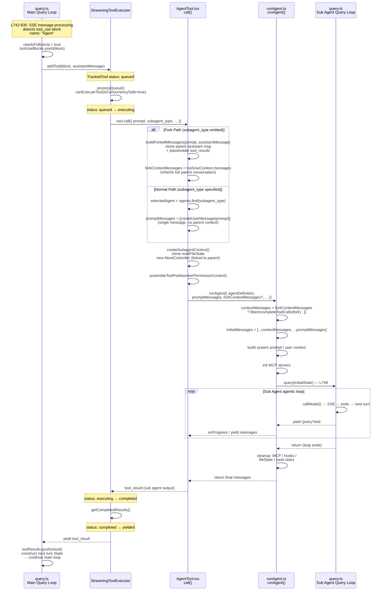

# Claude Code Sub Agent Deep Dive

> Full chain trace of the Sub Agent system based on Claude Code v2.1.88 decompiled source

---

## Table of Contents

1. [Overall Architecture](#1-overall-architecture)
2. [Code Chain](#2-code-chain)
3. [Triggers and Entry Points](#3-triggers-and-entry-points)
4. [Fork vs Normal — Two Paths](#4-fork-vs-normal--two-paths)
5. [Context Isolation](#5-context-isolation)
6. [Built-in Agent Types](#6-built-in-agent-types)
7. [Fork Prompt Cache Optimization](#7-fork-prompt-cache-optimization)
8. [Result Return Mechanism](#8-result-return-mechanism)
9. [Worktree Isolation](#9-worktree-isolation)
10. [Usage Recommendations](#10-usage-recommendations)

---

## 1. Overall Architecture

Sub Agent has no special treatment — it is just an **ordinary tool** in the query loop's eyes. `AgentTool` is dispatched by `StreamingToolExecutor` exactly the same way as `BashTool` or `ReadTool`. The only difference is that its `call()` implementation **launches another `query()` loop**.

```
┌──────────────────────────────────────────────────────────────────┐
│                    Parent Agent (main query loop)                 │
│                                                                  │
│  query.ts: detects tool_use(name:"Agent")                        │
│    → StreamingToolExecutor.addTool()                             │
│      → AgentTool.call()                                          │
│                                                                  │
│  ┌────────────────────────────────────────────────────────────┐  │
│  │ AgentTool.tsx L239: call()                                 │  │
│  │                                                            │  │
│  │  ┌─────────────────┐      ┌──────────────────────────┐    │  │
│  │  │ Fork Path       │      │ Normal Path              │    │  │
│  │  │ (subagent_type  │      │ (subagent_type specified) │    │  │
│  │  │  omitted)       │      │                          │    │  │
│  │  │                 │      │                          │    │  │
│  │  │ Inherits full   │      │ Single prompt            │    │  │
│  │  │ parent convo +  │      │ user message             │    │  │
│  │  │ system prompt   │      │ + own system prompt      │    │  │
│  │  └────────┬────────┘      └─────────────┬────────────┘    │  │
│  │           └──────────────┬──────────────┘                 │  │
│  │                          ▼                                │  │
│  │              createSubagentContext()                       │  │
│  │              clone readFileState                           │  │
│  │              new AbortController                          │  │
│  │                          │                                │  │
│  │                          ▼                                │  │
│  │                    runAgent()                              │  │
│  │                          │                                │  │
│  │                          ▼                                │  │
│  │              ┌───────────────────────┐                    │  │
│  │              │   Sub Agent's own     │                    │  │
│  │              │   query() loop        │                    │  │
│  │              │                       │                    │  │
│  │              │ callModel → tools     │                    │  │
│  │              │   → next turn → ...   │                    │  │
│  │              └───────────┬───────────┘                    │  │
│  │                          │                                │  │
│  │                    returns messages                        │  │
│  └──────────────────────────┼────────────────────────────────┘  │
│                             │                                    │
│  tool_result ◀──────────────┘                                    │
│  → main loop next turn                                           │
└──────────────────────────────────────────────────────────────────┘
```

---

## 2. Code Chain

### 2.1 ASCII Art Version

```
query.ts                    StreamingToolExecutor        AgentTool.tsx           runAgent.ts              query.ts (child)
  │                               │                         │                       │                       │
  │ L742-835: detects             │                         │                       │                       │
  │ tool_use name:"Agent"         │                         │                       │                       │
  │ needsFollowUp = true          │                         │                       │                       │
  │                               │                         │                       │                       │
  ├─ addTool(block, msg) ────────▶│                         │                       │                       │
  │                               │ status: queued          │                       │                       │
  │                               │                         │                       │                       │
  │                               │ processQueue()          │                       │                       │
  │                               │ canExecuteTool(true)    │                       │                       │
  │                               │ status: executing       │                       │                       │
  │                               │                         │                       │                       │
  │                               ├─ tool.call() ──────────▶│ L239: call()          │                       │
  │                               │                         │                       │                       │
  │                               │                         │ Fork or Normal?       │                       │
  │                               │                         │ createSubagentContext()│                       │
  │                               │                         │ assembleToolPool()    │                       │
  │                               │                         │                       │                       │
  │                               │                         ├─ runAgent() ─────────▶│                       │
  │                               │                         │                       │                       │
  │                               │                         │                       │ build initialMessages │
  │                               │                         │                       │ build system prompt   │
  │                               │                         │                       │ init MCP              │
  │                               │                         │                       │                       │
  │                               │                         │                       ├─ query() ────────────▶│
  │                               │                         │                       │                       │
  │                               │                         │                       │                 ┌─────┤
  │                               │                         │                       │                 │loop │
  │                               │                         │                       │  yield messages │     │
  │                               │                         │          ◀─────────── ◀────────────────┘     │
  │                               │                         │                       │                       │
  │                               │                         │                       │ cleanup               │
  │                               │        tool_result      │◀──────────────────────┤                       │
  │                               │◀────────────────────────┤                       │                       │
  │                               │                         │                       │                       │
  │                               │ status: completed       │                       │                       │
  │                               │ → yielded               │                       │                       │
  │  ◀── yield result ────────────┤                         │                       │                       │
  │                               │                         │                       │                       │
  │ toolResults.push(result)      │                         │                       │                       │
  │ construct next turn State     │                         │                       │                       │
  │ → continue main loop          │                         │                       │                       │
```

### 2.2 Mermaid Version



---

## 3. Triggers and Entry Points

### 3.1 Two Trigger Methods

**Method A — Model invokes Agent Tool (user-visible)**

The model outputs a `tool_use` block → the query loop hands it to StreamingToolExecutor like any other tool → ultimately executes `AgentTool.call()`.

```typescript
// AgentTool.tsx L239
async call({
  prompt,
  subagent_type,
  description,
  model,
  run_in_background,
  name,
  isolation,
  cwd,
}: AgentToolInput, toolUseContext, canUseTool, assistantMessage, onProgress?)
```

**Method B — Internal system calls `runForkedAgent()` directly**

Internal features like Session Memory extraction and Memory prefetch bypass AgentTool and call the underlying API directly:

```typescript
// forkedAgent.ts L489
export async function runForkedAgent({
  promptMessages,
  cacheSafeParams,
  canUseTool,
  querySource,
  forkLabel,
  maxTurns?,
  ...
}: ForkedAgentParams): Promise<ForkedAgentResult>
```

### 3.2 Fork Path Selection Logic

```typescript
// AgentTool.tsx L320-323
const effectiveType = subagent_type
  ?? (isForkSubagentEnabled() ? undefined : GENERAL_PURPOSE_AGENT.agentType)
const isForkPath = effectiveType === undefined
```

```
Model invokes Agent tool
    │
    ├─ subagent_type = "Explore" → Normal Path → Explore agent
    ├─ subagent_type = "Plan"    → Normal Path → Plan agent
    ├─ subagent_type = "general-purpose" → Normal Path
    │
    └─ subagent_type omitted?
        ├─ FORK_SUBAGENT gate ON  → Fork Path (inherits parent context)
        └─ FORK_SUBAGENT gate OFF → Normal Path → general-purpose
```

---

## 4. Fork vs Normal — Two Paths

### 4.1 Context Difference

This is the most critical distinction. The core code is at `runAgent.ts L370-373`:

```typescript
const contextMessages: Message[] = forkContextMessages
  ? filterIncompleteToolCalls(forkContextMessages)  // Fork: full parent conversation
  : []                                               // Normal: empty
const initialMessages: Message[] = [...contextMessages, ...promptMessages]
```

| Dimension | Fork Agent | Normal Agent (Explore/Plan/general-purpose) |
|-----------|-----------|----------------------------------------------|
| **Parent conversation history** | ✅ Full inheritance via `toolUseContext.messages` | ❌ None, `contextMessages = []` |
| **promptMessages** | Parent assistant msg + placeholder tool_results + directive | Single `createUserMessage(prompt)` |
| **System Prompt** | Identical to parent's rendered prompt | Agent's own `getSystemPrompt()` |
| **CLAUDE.md** | Implicitly included via parent context | Explore/Plan omit it (`omitClaudeMd`), general-purpose includes it |
| **Git Status** | Implicitly included via parent context | Explore/Plan omit it, others include it |
| **Tool pool** | Identical to parent (`useExactTools: true`) | Independently assembled via `assembleToolPool()` |
| **readFileState** | `cloneFileStateCache(parent)` — cloned | `createFileStateCacheWithSizeLimit()` — fresh empty cache |
| **Permission mode** | `bubble` (bubbles up to parent terminal) | `acceptEdits` (auto-accepts edits) |

### 4.2 Message Structure Comparison

```
What a Fork Agent sees:
┌────────────────────────────────────────────────────┐
│ [system prompt — identical to parent]              │
│                                                    │
│ [all parent history messages...]                   │ ← full context
│ [parent's last assistant msg (thinking + tools)]   │
│ [user: placeholder tool_results + directive]       │ ← only directive differs
└────────────────────────────────────────────────────┘

What a Normal Agent (e.g. Explore) sees:
┌────────────────────────────────────────────────────┐
│ [system prompt — agent's own]                      │
│                                                    │
│ [user: "Analyze the exit conditions in query.ts"]  │ ← just this one message
└────────────────────────────────────────────────────┘
```

---

## 5. Context Isolation

### 5.1 createSubagentContext()

`forkedAgent.ts L345-462`:

```
┌──────────────────────────────────────────────────┐
│           createSubagentContext()                 │
│                                                  │
│  ┌─────────────────────┐  ┌───────────────────┐  │
│  │  Cloned (isolated)  │  │  Linked (shared)  │  │
│  │                     │  │                   │  │
│  │  • readFileState    │  │  • abortController│  │
│  │    (deep copy)      │  │    (child→parent) │  │
│  │                     │  │                   │  │
│  │  • toolDecisions    │  │                   │  │
│  │    (fresh)          │  │                   │  │
│  └─────────────────────┘  └───────────────────┘  │
│                                                  │
│  ┌─────────────────────┐  ┌───────────────────┐  │
│  │  Default noop       │  │  Optional sharing │  │
│  │                     │  │                   │  │
│  │  • setAppState      │  │  shareSetAppState │  │
│  │  • setAppStateFor   │  │  shareAbort       │  │
│  │    Tasks            │  │  Controller       │  │
│  └─────────────────────┘  └───────────────────┘  │
└──────────────────────────────────────────────────┘
```

### 5.2 Abort Cascade

```
Parent AbortController
    │
    └─ Child agent AbortController (new, listens to parent)
        │
        ├─ Parent abort → automatically cascades to child
        ├─ Child abort → does NOT affect parent (default)
        └─ shareAbortController=true → shares the same controller
```

---

## 6. Built-in Agent Types

| Type | Model | Tool Restrictions | Permission Mode | Omit CLAUDE.md | Omit gitStatus | Purpose |
|------|-------|-------------------|-----------------|----------------|----------------|---------|
| `Explore` | haiku (external) | Glob, Grep, Read, Bash(read-only) | plan | ✅ | ✅ | Fast code search |
| `Plan` | inherited | No Edit/Write/Execute | plan | ❌ | ✅ | Architecture planning |
| `general-purpose` | inherited | All | acceptEdits | ❌ | ❌ | Default general |
| `verification` | inherited | Bash, Read, Grep | — | ❌ | ❌ | Independent verification |
| `claude-code-guide` | inherited | Limited | — | ❌ | ❌ | CLI/API help |
| `fork` | inherited | Identical to parent | bubble | ❌ (implicit) | ❌ (implicit) | Parallel subtasks |

**Explore's extreme optimization** (34M+ monthly invocations):
- Omit CLAUDE.md → saves 5-15 Gtok/week
- Omit gitStatus → saves 1-3 Gtok/week
- Uses haiku model → lowest cost

---

## 7. Fork Prompt Cache Optimization

### 7.1 buildForkedMessages() Cache Strategy

```typescript
// forkSubagent.ts L107-169
function buildForkedMessages(directive, assistantMessage): Message[] {
  // 1. Clone parent assistant message (all thinking + text + tool_use blocks)
  const fullAssistantMessage = { ...assistantMessage, uuid: randomUUID() }

  // 2. Generate identical placeholder results for each tool_use
  const toolResultBlocks = toolUseBlocks.map(block => ({
    type: 'tool_result',
    tool_use_id: block.id,
    content: [{ type: 'text', text: FORK_PLACEHOLDER_RESULT }]
    //                                 ↑ identical across all fork children
  }))

  // 3. The only differing part: directive
  return [fullAssistantMessage, userMessage([...toolResultBlocks, directiveText])]
}
```

```
Fork Child 1:                         Fork Child 2:
┌─────────────────────────┐           ┌─────────────────────────┐
│ system prompt (same)    │ ◄─ cache  │ system prompt (same)    │
│ history msgs... (same)  │ ◄─ hit    │ history msgs... (same)  │
│ assistant msg (same)    │ ◄─ hit    │ assistant msg (same)    │
│ tool_results (same)     │ ◄─ hit    │ tool_results (same)     │
│─────────────────────────│           │─────────────────────────│
│ directive: "analyze A"  │ ◄─ only   │ directive: "analyze B"  │
└─────────────────────────┘  differs  └─────────────────────────┘

→ Anthropic API prompt cache achieves near 100% prefix hit rate
```

### 7.2 CacheSafeParams

```typescript
// forkedAgent.ts L57-68
type CacheSafeParams = {
  systemPrompt: SystemPrompt        // must be identical to parent
  userContext: { [k: string]: string }
  systemContext: { [k: string]: string }
  toolUseContext: ToolUseContext
  forkContextMessages: Message[]    // parent context messages
}
```

---

## 8. Result Return Mechanism

### 8.1 Three Return Modes

```
┌─────────────────────────────────────┐
│         Synchronous Agent            │
│                                     │
│  AgentTool calls runAgent()         │
│  for await (msg of runAgent()) {    │
│    collect messages                 │
│  }                                  │
│  → assemble as tool_result          │
│  → return to main query loop's      │
│     StreamingToolExecutor           │
└─────────────────────────────────────┘

┌─────────────────────────────────────┐
│    Async Agent (run_in_background)   │
│                                     │
│  ① AgentTool returns immediately:   │
│     { status: 'async_launched',     │
│       agentId, outputFile }         │
│                                     │
│  ② Child agent runs in background   │
│     messages written to outputFile  │
│                                     │
│  ③ On completion <task-notification>│
│     parent picks up result next turn│
└─────────────────────────────────────┘

┌─────────────────────────────────────┐
│    Internal Forked Agent             │
│    (Session Memory, etc.)           │
│                                     │
│  runForkedAgent() returns:          │
│  {                                  │
│    messages: Message[],             │
│    totalUsage: NonNullableUsage     │
│  }                                  │
│  Caller consumes messages directly  │
└─────────────────────────────────────┘
```

### 8.2 Fork Child Output Format

`buildChildMessage()` hardcodes the fork child's output rules:

```
RULES:
1. Cannot fork again (recursion guard)
2. No questions, no suggestions
3. Use tools directly
4. Commit before modifying files
5. No text output between tool calls
6. Stay strictly within directive scope
7. Report < 500 words

Output format:
  Scope: <task scope>
  Result: <key findings>
  Key files: <relevant files>
  Files changed: <modified files + commit hash>
  Issues: <problems>
```

---

## 9. Worktree Isolation

```
When isolation: 'worktree' is set:

┌─────────────────────────────────────────┐
│ createAgentWorktree('agent-a1b2c3d4')   │
│                                         │
│ Path: .claude/worktrees/agent-a1b2c3d4/ │
│ Branch: independent new branch          │
│ Records: headCommit (for change detect) │
└────────────────────┬────────────────────┘
                     │
                     ▼
┌─────────────────────────────────────────┐
│ Child agent works in the worktree       │
│                                         │
│ • All file ops target worktree path     │
│ • buildWorktreeNotice() tells agent:    │
│   "You're in an isolated worktree,      │
│    paths need translation"              │
│ • Fully isolated from parent filesystem │
└────────────────────┬────────────────────┘
                     │
                     ▼
┌─────────────────────────────────────────┐
│ cleanupWorktreeIfNeeded()               │
│                                         │
│ hasWorktreeChanges(path, headCommit)?   │
│   ├─ No changes → removeAgentWorktree()│
│   │               auto-deleted          │
│   └─ Has changes → keep worktree       │
│                    user can review/merge │
│                                         │
│ Expiry: auto-cleanup after >30 days     │
└─────────────────────────────────────────┘
```

---

## 10. Usage Recommendations

Based on the source code implementation:

### 10.1 Choose the Right Agent Type

| Scenario | Recommended Type | Reason |
|----------|-----------------|--------|
| Search/locate code | `Explore` | haiku model + omits CLAUDE.md/gitStatus, lowest cost and fastest |
| Need to modify files | `general-purpose` or fork | Has full tool pool |
| Architecture planning | `Plan` | Read-only mode prevents accidental changes |
| Need parent context | Omit type (fork) | Only way to inherit conversation history |
| Independent verification | `verification` | Independent review, avoids confirmation bias |

### 10.2 Parallelism Optimization

- Agent tool's `isConcurrencySafe = true` → **multiple sub agents can run in parallel**
- Invoke multiple Agent tools in a single message → StreamingToolExecutor dispatches them in parallel
- Fork mode parallel children share prompt cache prefix → lowest API cost

### 10.3 Pitfalls to Avoid

- **Don't nest forks** — source code enforces `isInForkChild()` check; fork children cannot fork again
- **Explore agent has no parent context** — it doesn't know what you discussed before; prompts must be self-contained
- **Async agents can't prompt for permissions** — `shouldAvoidPermissionPrompts = true`; permission mismatches are auto-denied
- **readFileState is cloned** — files read by child don't enter parent's cache; parent may re-read them

### 10.4 Controlling Token Consumption

- Fork's `CacheSafeParams` guarantees prompt cache hits — avoid modifying the system prompt
- Explore's `omitClaudeMd` design shows: CLAUDE.md is the main token cost for high-volume sub-agent calls
- Fork child reports are limited to 500 words — controls tokens returned to parent
- For more detailed results, specify explicitly in the directive

---

*Generated: 2026-05-21*
*Based on Claude Code v2.1.88 decompiled source*
