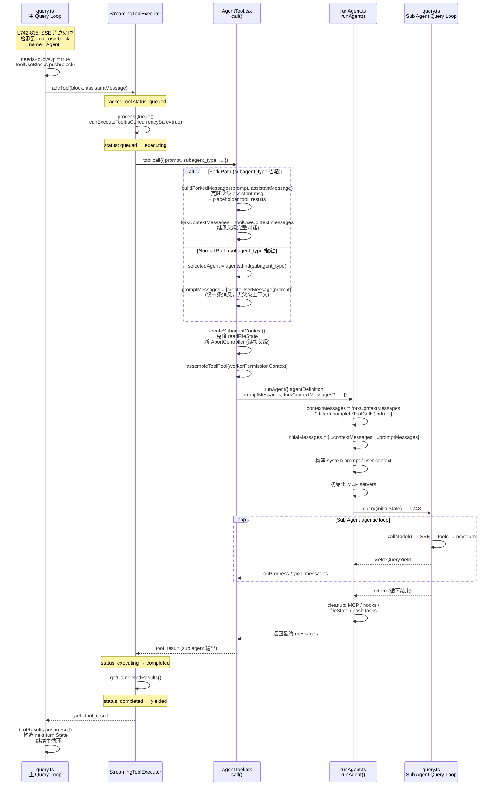

# Claude Code Sub Agent 深度分析

> 基于 Claude Code v2.1.88 反编译源码的 Sub Agent 系统全链路追踪

---

## 目录

1. [整体架构](#1-整体架构)
2. [代码链路](#2-代码链路)
3. [触发与入口](#3-触发与入口)
4. [Fork vs Normal 两种路径](#4-fork-vs-normal-两种路径)
5. [上下文隔离机制](#5-上下文隔离机制)
6. [Built-in Agent 类型](#6-built-in-agent-类型)
7. [Fork 的 Prompt Cache 优化](#7-fork-的-prompt-cache-优化)
8. [结果返回机制](#8-结果返回机制)
9. [Worktree 隔离](#9-worktree-隔离)
10. [使用建议](#10-使用建议)

---

## 1. 整体架构

Sub Agent 没有任何特殊待遇 — 它就是 query loop 眼中的一个**普通 tool**。`AgentTool` 和 `BashTool`、`ReadTool` 一样，通过 `StreamingToolExecutor` 被调度执行。唯一特别之处在于它的 `call()` 实现里会**启动另一个 `query()` 循环**。

```
┌──────────────────────────────────────────────────────────────────┐
│                    Parent Agent (主 query loop)                   │
│                                                                  │
│  query.ts: 检测 tool_use(name:"Agent")                          │
│    → StreamingToolExecutor.addTool()                             │
│      → AgentTool.call()                                          │
│                                                                  │
│  ┌────────────────────────────────────────────────────────────┐  │
│  │ AgentTool.tsx L239: call()                                 │  │
│  │                                                            │  │
│  │  ┌─────────────────┐      ┌──────────────────────────┐    │  │
│  │  │ Fork Path       │      │ Normal Path              │    │  │
│  │  │ (subagent_type  │      │ (subagent_type 指定)     │    │  │
│  │  │  省略)           │      │                          │    │  │
│  │  │                 │      │                          │    │  │
│  │  │ 继承父级完整    │      │ 仅一条 prompt            │    │  │
│  │  │ 对话历史 +      │      │ user message             │    │  │
│  │  │ system prompt   │      │ + 独立 system prompt     │    │  │
│  │  └────────┬────────┘      └─────────────┬────────────┘    │  │
│  │           └──────────────┬──────────────┘                 │  │
│  │                          ▼                                │  │
│  │              createSubagentContext()                       │  │
│  │              克隆 readFileState                            │  │
│  │              新 AbortController                           │  │
│  │                          │                                │  │
│  │                          ▼                                │  │
│  │                    runAgent()                              │  │
│  │                          │                                │  │
│  │                          ▼                                │  │
│  │              ┌───────────────────────┐                    │  │
│  │              │   Sub Agent 独立      │                    │  │
│  │              │   query() 循环        │                    │  │
│  │              │                       │                    │  │
│  │              │ callModel → tools     │                    │  │
│  │              │   → next turn → ...   │                    │  │
│  │              └───────────┬───────────┘                    │  │
│  │                          │                                │  │
│  │                    返回 messages                           │  │
│  └──────────────────────────┼────────────────────────────────┘  │
│                             │                                    │
│  tool_result ◀──────────────┘                                    │
│  → 主循环下一轮                                                   │
└──────────────────────────────────────────────────────────────────┘
```

---

## 2. 代码链路

### 2.1 ASCII Art 版本

```
query.ts                    StreamingToolExecutor        AgentTool.tsx           runAgent.ts              query.ts (子)
  │                               │                         │                       │                       │
  │ L742-835: 检测到              │                         │                       │                       │
  │ tool_use name:"Agent"         │                         │                       │                       │
  │ needsFollowUp = true          │                         │                       │                       │
  │                               │                         │                       │                       │
  ├─ addTool(block, msg) ────────▶│                         │                       │                       │
  │                               │ status: queued          │                       │                       │
  │                               │                         │                       │                       │
  │                               │ processQueue()          │                       │                       │
  │                               │ canExecuteTool(true)    │                       │                       │
  │                               │ status: executing       │                       │                       │
  │                               │                         │                       │                       │
  │                               ├─ tool.call() ──────────▶│ L239: call()          │                       │
  │                               │                         │                       │                       │
  │                               │                         │ Fork or Normal?       │                       │
  │                               │                         │ createSubagentContext()│                       │
  │                               │                         │ assembleToolPool()    │                       │
  │                               │                         │                       │                       │
  │                               │                         ├─ runAgent() ─────────▶│                       │
  │                               │                         │                       │                       │
  │                               │                         │                       │ 构建 initialMessages  │
  │                               │                         │                       │ 构建 system prompt    │
  │                               │                         │                       │ 初始化 MCP            │
  │                               │                         │                       │                       │
  │                               │                         │                       ├─ query() ────────────▶│
  │                               │                         │                       │                       │
  │                               │                         │                       │                 ┌─────┤
  │                               │                         │                       │                 │循环  │
  │                               │                         │                       │  yield messages │     │
  │                               │                         │          ◀─────────── ◀────────────────┘     │
  │                               │                         │                       │                       │
  │                               │                         │                       │ cleanup               │
  │                               │        tool_result      │◀──────────────────────┤                       │
  │                               │◀────────────────────────┤                       │                       │
  │                               │                         │                       │                       │
  │                               │ status: completed       │                       │                       │
  │                               │ → yielded               │                       │                       │
  │  ◀── yield result ────────────┤                         │                       │                       │
  │                               │                         │                       │                       │
  │ toolResults.push(result)      │                         │                       │                       │
  │ 构造 next turn State          │                         │                       │                       │
  │ → 继续主循环                   │                         │                       │                       │
```

### 2.2 Mermaid 版本



---

## 3. 触发与入口

### 3.1 两种触发方式

**方式 A — 模型调用 Agent Tool（用户可见）**

模型输出 `tool_use` block → query loop 像处理任何其他 tool 一样交给 StreamingToolExecutor → 最终执行 `AgentTool.call()`。

```typescript
// AgentTool.tsx L239
async call({
  prompt,
  subagent_type,
  description,
  model,
  run_in_background,
  name,
  isolation,
  cwd,
}: AgentToolInput, toolUseContext, canUseTool, assistantMessage, onProgress?)
```

**方式 B — 系统内部直接调用 `runForkedAgent()`**

Session Memory 提取、Memory 预取等内部功能绕过 AgentTool，直接调用底层 API：

```typescript
// forkedAgent.ts L489
export async function runForkedAgent({
  promptMessages,
  cacheSafeParams,
  canUseTool,
  querySource,
  forkLabel,
  maxTurns?,
  ...
}: ForkedAgentParams): Promise<ForkedAgentResult>
```

### 3.2 Fork 路径的选择逻辑

```typescript
// AgentTool.tsx L320-323
const effectiveType = subagent_type
  ?? (isForkSubagentEnabled() ? undefined : GENERAL_PURPOSE_AGENT.agentType)
const isForkPath = effectiveType === undefined
```

```
模型调用 Agent tool
    │
    ├─ subagent_type = "Explore" → Normal Path → Explore agent
    ├─ subagent_type = "Plan"    → Normal Path → Plan agent
    ├─ subagent_type = "general-purpose" → Normal Path
    │
    └─ subagent_type 省略?
        ├─ FORK_SUBAGENT gate ON  → Fork Path（继承父上下文）
        └─ FORK_SUBAGENT gate OFF → Normal Path → general-purpose
```

---

## 4. Fork vs Normal 两种路径

### 4.1 上下文差异

这是最关键的区别。核心代码在 `runAgent.ts L370-373`：

```typescript
const contextMessages: Message[] = forkContextMessages
  ? filterIncompleteToolCalls(forkContextMessages)  // Fork: 父级完整对话
  : []                                               // Normal: 空
const initialMessages: Message[] = [...contextMessages, ...promptMessages]
```

| 维度 | Fork Agent | Normal Agent (Explore/Plan/general-purpose) |
|------|-----------|----------------------------------------------|
| **父级对话历史** | ✅ 完整继承 `toolUseContext.messages` | ❌ 没有，`contextMessages = []` |
| **promptMessages** | 父级 assistant msg + placeholder tool_results + directive | 仅一条 `createUserMessage(prompt)` |
| **System Prompt** | 父级完全相同的 rendered prompt | agent 自己的 `getSystemPrompt()` |
| **CLAUDE.md** | 通过父级 context 隐式包含 | Explore/Plan 省略 (`omitClaudeMd`)，general-purpose 包含 |
| **Git Status** | 通过父级 context 隐式包含 | Explore/Plan 省略，其它包含 |
| **工具池** | 父级完全相同 (`useExactTools: true`) | 按 agent 定义独立 `assembleToolPool()` |
| **readFileState** | `cloneFileStateCache(parent)` — 克隆 | `createFileStateCacheWithSizeLimit()` — 全新空缓存 |
| **权限模式** | `bubble`（冒泡到父级终端） | `acceptEdits`（自动接受编辑） |

### 4.2 消息结构对比

```
Fork Agent 看到的消息:
┌────────────────────────────────────────────────────┐
│ [system prompt — 与父级完全相同]                    │
│                                                    │
│ [父级所有历史消息...]                               │ ← 完整上下文
│ [父级最后一条 assistant msg (含 thinking + tools)]  │
│ [user: placeholder tool_results + directive]       │ ← 仅 directive 不同
└────────────────────────────────────────────────────┘

Normal Agent (如 Explore) 看到的消息:
┌────────────────────────────────────────────────────┐
│ [system prompt — agent 自己的]                      │
│                                                    │
│ [user: "请分析一下 src/query.ts 的退出条件"]         │ ← 仅此一条
└────────────────────────────────────────────────────┘
```

---

## 5. 上下文隔离机制

### 5.1 createSubagentContext()

`forkedAgent.ts L345-462`:

```
┌──────────────────────────────────────────────────┐
│           createSubagentContext()                 │
│                                                  │
│  ┌─────────────────────┐  ┌───────────────────┐  │
│  │  克隆 (独立)         │  │  链接 (受控共享)   │  │
│  │                     │  │                   │  │
│  │  • readFileState    │  │  • abortController│  │
│  │    (深拷贝)         │  │    (子→父级联)    │  │
│  │                     │  │                   │  │
│  │  • toolDecisions    │  │                   │  │
│  │    (全新)           │  │                   │  │
│  └─────────────────────┘  └───────────────────┘  │
│                                                  │
│  ┌─────────────────────┐  ┌───────────────────┐  │
│  │  默认 noop          │  │  可选共享          │  │
│  │                     │  │                   │  │
│  │  • setAppState      │  │  shareSetAppState │  │
│  │  • setAppStateFor   │  │  shareAbort       │  │
│  │    Tasks            │  │  Controller       │  │
│  └─────────────────────┘  └───────────────────┘  │
└──────────────────────────────────────────────────┘
```

### 5.2 Abort 级联

```
父级 AbortController
    │
    └─ 子 agent AbortController (新建，监听父级)
        │
        ├─ 父级 abort → 自动级联到子 agent
        ├─ 子 agent abort → 不影响父级（默认）
        └─ shareAbortController=true → 共享同一个 controller
```

---

## 6. Built-in Agent 类型

| 类型 | 模型 | 工具限制 | 权限模式 | 省略 CLAUDE.md | 省略 gitStatus | 用途 |
|------|------|---------|----------|---------------|---------------|------|
| `Explore` | haiku (外部) | Glob, Grep, Read, Bash(只读) | plan | ✅ | ✅ | 快速代码搜索 |
| `Plan` | 继承 | 无 Edit/Write/Execute | plan | ❌ | ✅ | 架构规划 |
| `general-purpose` | 继承 | 全部 | acceptEdits | ❌ | ❌ | 默认通用 |
| `verification` | 继承 | Bash, Read, Grep | — | ❌ | ❌ | 独立验证 |
| `claude-code-guide` | 继承 | 有限 | — | ❌ | ❌ | CLI/API 帮助 |
| `fork` | 继承 | 父级完全相同 | bubble | ❌ (隐式) | ❌ (隐式) | 并行子任务 |

**Explore 的极致优化**（月调用量 34M+）：
- 省略 CLAUDE.md → 节约 5-15 Gtok/周
- 省略 gitStatus → 节约 1-3 Gtok/周
- 使用 haiku 模型 → 成本最低

---

## 7. Fork 的 Prompt Cache 优化

### 7.1 buildForkedMessages() 的缓存策略

```typescript
// forkSubagent.ts L107-169
function buildForkedMessages(directive, assistantMessage): Message[] {
  // 1. 克隆父级 assistant message（所有 thinking + text + tool_use blocks）
  const fullAssistantMessage = { ...assistantMessage, uuid: randomUUID() }

  // 2. 为每个 tool_use 生成相同的 placeholder result
  const toolResultBlocks = toolUseBlocks.map(block => ({
    type: 'tool_result',
    tool_use_id: block.id,
    content: [{ type: 'text', text: FORK_PLACEHOLDER_RESULT }]
    //                                 ↑ 所有 fork children 完全相同
  }))

  // 3. 唯一不同的部分: directive
  return [fullAssistantMessage, userMessage([...toolResultBlocks, directiveText])]
}
```

```
Fork Child 1:                         Fork Child 2:
┌─────────────────────────┐           ┌─────────────────────────┐
│ system prompt (相同)    │ ◄─ cache  │ system prompt (相同)    │
│ 历史消息... (相同)      │ ◄─ hit    │ 历史消息... (相同)      │
│ assistant msg (相同)    │ ◄─ hit    │ assistant msg (相同)    │
│ tool_results (相同)     │ ◄─ hit    │ tool_results (相同)     │
│─────────────────────────│           │─────────────────────────│
│ directive: "分析模块A"  │ ◄─ 唯一   │ directive: "分析模块B"  │
└─────────────────────────┘  不同     └─────────────────────────┘

→ Anthropic API prompt cache 几乎 100% 命中前缀
```

### 7.2 CacheSafeParams

```typescript
// forkedAgent.ts L57-68
type CacheSafeParams = {
  systemPrompt: SystemPrompt        // 必须与父级完全相同
  userContext: { [k: string]: string }
  systemContext: { [k: string]: string }
  toolUseContext: ToolUseContext
  forkContextMessages: Message[]    // 父级上下文消息
}
```

---

## 8. 结果返回机制

### 8.1 三种返回模式

```
┌─────────────────────────────────────┐
│         同步 Agent                   │
│                                     │
│  AgentTool 调用 runAgent()          │
│  for await (msg of runAgent()) {    │
│    收集 messages                    │
│  }                                  │
│  → 组装为 tool_result               │
│  → 返回到主 query loop 的           │
│     StreamingToolExecutor           │
└─────────────────────────────────────┘

┌─────────────────────────────────────┐
│    异步 Agent (run_in_background)    │
│                                     │
│  ① AgentTool 立即返回:              │
│     { status: 'async_launched',     │
│       agentId, outputFile }         │
│                                     │
│  ② 子 agent 后台运行               │
│     消息写入 outputFile             │
│                                     │
│  ③ 完成后 <task-notification>       │
│     父级下一轮自动收到结果           │
└─────────────────────────────────────┘

┌─────────────────────────────────────┐
│    内部 Forked Agent                 │
│    (Session Memory 等直接调用)       │
│                                     │
│  runForkedAgent() 返回:             │
│  {                                  │
│    messages: Message[],             │
│    totalUsage: NonNullableUsage     │
│  }                                  │
│  调用方直接消费 messages             │
└─────────────────────────────────────┘
```

### 8.2 Fork Child 的输出格式

`buildChildMessage()` 中硬编码了 fork child 的输出规则：

```
RULES:
1. 不能再 fork（递归防护）
2. 不提问、不建议
3. 直接使用工具
4. 修改文件要先 commit
5. 工具调用间不输出文本
6. 严格在 directive 范围内
7. 报告 < 500 字

Output format:
  Scope: <任务范围>
  Result: <关键发现>
  Key files: <相关文件>
  Files changed: <修改的文件 + commit hash>
  Issues: <问题>
```

---

## 9. Worktree 隔离

```
isolation: 'worktree' 设置时:

┌─────────────────────────────────────────┐
│ createAgentWorktree('agent-a1b2c3d4')   │
│                                         │
│ 路径: .claude/worktrees/agent-a1b2c3d4/ │
│ 分支: 独立新分支                         │
│ 记录: headCommit (用于变更检测)          │
└────────────────────┬────────────────────┘
                     │
                     ▼
┌─────────────────────────────────────────┐
│ 子 agent 在 worktree 中工作             │
│                                         │
│ • 所有文件操作指向 worktree 路径         │
│ • buildWorktreeNotice() 告知子 agent:   │
│   "你在隔离的 worktree 中，路径需转换"  │
│ • 与父级文件系统完全隔离                 │
└────────────────────┬────────────────────┘
                     │
                     ▼
┌─────────────────────────────────────────┐
│ cleanupWorktreeIfNeeded()               │
│                                         │
│ hasWorktreeChanges(path, headCommit)?   │
│   ├─ 无变更 → removeAgentWorktree()    │
│   │           自动删除                  │
│   └─ 有变更 → 保留 worktree            │
│               用户可查看/合并            │
│                                         │
│ 过期回收: >30天自动清理                  │
└─────────────────────────────────────────┘
```

---

## 10. 使用建议

基于源码实现，给出以下建议：

### 10.1 选择正确的 agent 类型

| 场景 | 推荐类型 | 原因 |
|------|---------|------|
| 搜索/定位代码 | `Explore` | haiku 模型 + 省略 CLAUDE.md/gitStatus，成本最低速度最快 |
| 需要修改文件 | `general-purpose` 或 fork | 有完整工具池 |
| 架构规划 | `Plan` | 只读模式，防止意外修改 |
| 需要父级上下文 | 省略 type (fork) | 唯一能继承对话历史的方式 |
| 独立验证 | `verification` | 独立审查，避免确认偏误 |

### 10.2 并行优化

- Agent tool 的 `isConcurrencySafe = true` → **多个 sub agent 可并行执行**
- 在一条消息中同时调用多个 Agent tool → StreamingToolExecutor 并行调度
- Fork 模式下并行子 agent 共享 prompt cache prefix → API 成本最低

### 10.3 避免的陷阱

- **不要嵌套 fork** — 源码硬性检查 `isInForkChild()`，fork child 不能再 fork
- **Explore agent 没有父级上下文** — 它不知道你之前讨论了什么，prompt 要自包含
- **异步 agent 不能弹权限对话框** — `shouldAvoidPermissionPrompts = true`，权限不匹配会被自动拒绝
- **readFileState 是克隆的** — 子 agent 读过的文件不会进入父级缓存，父级可能重复读取

### 10.4 控制 Token 消耗

- Fork 的 `CacheSafeParams` 保证 prompt cache 命中 — 避免修改 system prompt
- Explore 的 `omitClaudeMd` 设计表明：大量 sub-agent 调用时 CLAUDE.md 是主要 token 开销
- Fork child 报告限制 500 字 — 控制返回给父级的 token 数
- 如需更详细结果，在 directive 中明确说明

---

*文档生成时间: 2026-05-21*
*基于 Claude Code v2.1.88 反编译源码*
